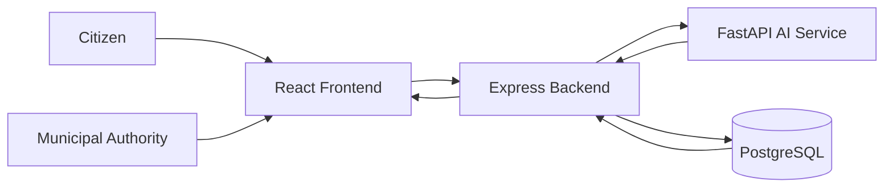
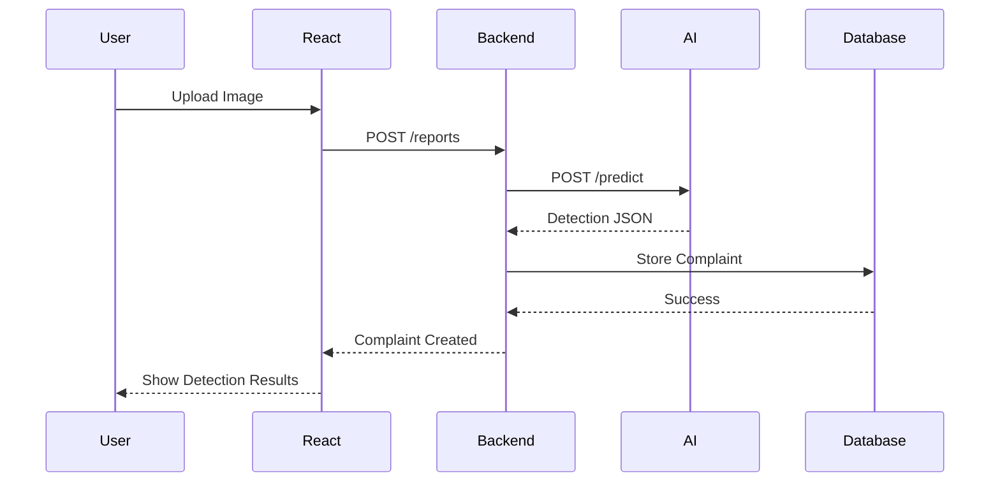

# NagarConnect Architecture

## Overview

NagarConnect is an AI-powered civic issue reporting platform that enables citizens to report public infrastructure problems such as potholes, road cracks, garbage accumulation, open manholes, and waterlogging.

The platform follows a microservices architecture consisting of four major components:

- React Frontend
- Node.js + Express Backend
- FastAPI AI Service
- PostgreSQL Database

Each component has a dedicated responsibility and communicates through REST APIs. Docker and Docker Compose are used to containerize and deploy the entire system.

---

# Technology Stack

| Layer | Technology |
|--------|------------|
| Frontend | React, Tailwind CSS, Axios |
| Backend | Node.js, Express.js |
| Authentication | JWT, bcrypt |
| AI Service | Python, FastAPI, YOLOv8 |
| Database | PostgreSQL |
| Containerization | Docker, Docker Compose |
| Version Control | Git, GitHub |

---

# High-Level System Architecture



---

# Component Responsibilities

## 1. React Frontend

Responsibilities

- User Registration
- User Login
- Upload Complaint Images
- Capture GPS Location
- Display AI Detection Results
- View Complaint Status
- Admin Dashboard

Technologies

- React
- Tailwind CSS
- Axios

---

## 2. Express Backend

Responsibilities

- JWT Authentication
- User Management
- Complaint Management
- Image Upload
- Database Operations
- Call AI Service
- Return Detection Results
- Notification Management

Technologies

- Node.js
- Express.js
- Multer
- JWT
- bcrypt

---

## 3. FastAPI AI Service

Responsibilities

- Receive Uploaded Images
- Run Custom YOLOv8 Model
- Detect Civic Issues
- Return Bounding Boxes
- Return Confidence Scores

Technologies

- Python
- FastAPI
- YOLOv8

---

## 4. PostgreSQL Database

Responsibilities

- Store Users
- Store Reports
- Store Images
- Store AI Predictions
- Store Complaint Status
- Store Notifications
- Store Assignment Information

---

# Complete Request Lifecycle

## Step 1 — User Upload

Citizen uploads an image using the React application.

---

## Step 2 — Backend Processing

Express receives:

- Image
- GPS Coordinates
- Description
- User Information

The image is temporarily stored.

---

## Step 3 — AI Detection

Backend sends the image to the FastAPI AI Service.

FastAPI loads the trained YOLOv8 model.

The model predicts:

- Class
- Confidence
- Bounding Box

---

## Step 4 — AI Response

The AI Service returns:

```json
{
  "detections": [
    {
      "class": "Pothole",
      "confidence": 0.96,
      "bbox": [120,85,310,240]
    }
  ]
}
```

---

## Step 5 — Database Storage

The backend stores

- Complaint
- Image Path
- AI Prediction
- GPS Coordinates
- Timestamp
- User Information

inside PostgreSQL.

---

## Step 6 — Notification

The backend creates a notification for the appropriate municipal department.

---

## Step 7 — Response

Backend returns

- Complaint ID
- Detection Results
- Status

to the frontend.

---

## Step 8 — Complaint Resolution

Municipal authorities

- View Complaints
- Assign Departments
- Update Status
- Mark Completed

The user can track the complaint in real time.

---

# Service Communication



---

# External Services

## PostgreSQL

Stores

- Users
- Reports
- Images
- Notifications
- Assignments
- Status History

---

## Docker

Runs every service inside isolated containers.

---

## Docker Compose

Starts

- Frontend
- Backend
- AI Service
- PostgreSQL

using one command.

---

# Security

## JWT Authentication

Protects all private endpoints.

---

## Password Hashing

Passwords are hashed using bcrypt before storage.

---

## Input Validation

Every request is validated before processing.

---

## File Upload Validation

Only image files are accepted.

Maximum upload size is restricted.

---

## Rate Limiting

Protects APIs against abuse and denial-of-service attacks.

---

# Error Handling

## AI Service Unavailable

Backend returns:

- HTTP 503
- Error message

The request can be retried later.

---

## Database Failure

Backend returns:

- HTTP 500
- Database unavailable

Future versions may queue failed requests.

---

## Invalid Image

Backend rejects

- Unsupported file type
- Corrupted image
- Oversized image

with HTTP 400.

---

# Scalability

The system is designed so each service can scale independently.

### React

Can be deployed on multiple web servers behind a load balancer.

### Express Backend

Multiple backend containers can run simultaneously.

### AI Service

Additional FastAPI containers can be deployed as image traffic increases.

### PostgreSQL

Can scale vertically or through replication for high availability.

---

# Future Improvements

- Real-time complaint updates using WebSockets
- Email notifications
- SMS alerts
- Push notifications
- Role-based access control
- Admin analytics dashboard
- Heatmap of reported issues
- AI model versioning
- Kubernetes deployment
- Cloud object storage for uploaded images

---

# Summary

NagarConnect follows a modular microservices architecture that separates the frontend, backend, AI service, and database into independent components.

This architecture provides:

- Clean separation of concerns
- Easy maintenance
- Independent scalability
- Secure authentication
- AI-powered image detection
- Docker-based deployment
- A strong foundation for future enhancements

The design enables parallel development, allowing frontend, backend, and AI teams to work independently while integrating through well-defined APIs.