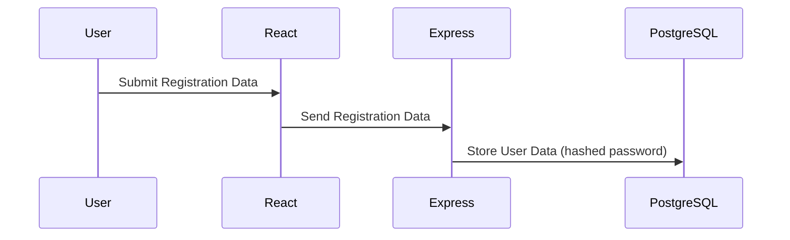
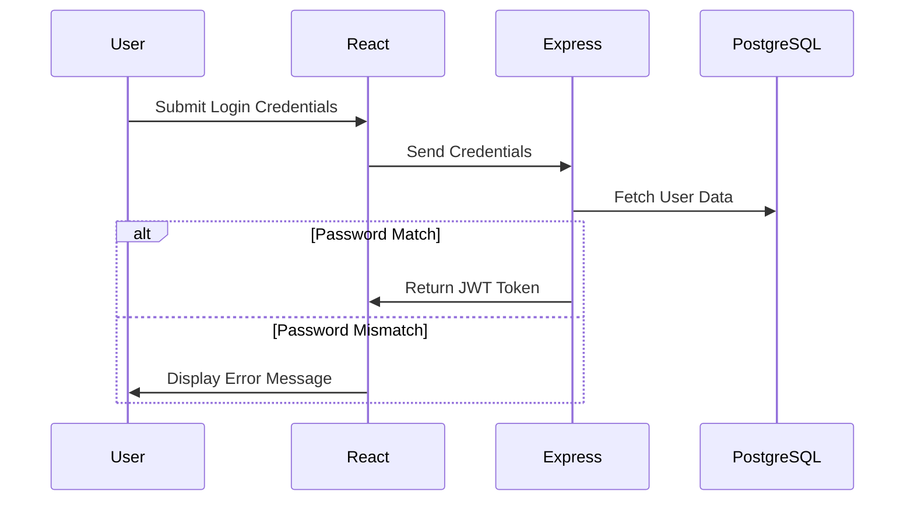

```markdown
# Authentication Documentation for NagarConnect

## 1. Overview

The authentication system of NagarConnect utilizes JSON Web Tokens (JWT) and bcrypt to ensure secure user registration, login, and access control. The platform supports two roles: Citizen and Admin, each with distinct permissions.

## 2. User Roles

### Citizen
- **Access**: Can report civic issues, view their reported issues, and update issue status if they have the necessary permissions.
- **Endpoints**:
  - `GET /issues`
  - `POST /issues`
  - `PATCH /issues/:id` (if applicable)
  
### Admin
- **Access**: Full access to all functionality including reporting, viewing, updating, and deleting civic issues. Additionally, they can manage user accounts.
- **Endpoints**:
  - All endpoints listed under Citizen
  - Additional management endpoints for users and issues

## 3. Registration Flow

The registration process involves the following steps:

1. User submits registration data (email, username, password) via a form on the frontend.
2. React sends this data to the backend using Axios.
3. Express.js validates the data and hashes the password using bcrypt.
4. The hashed password along with other user details are stored in PostgreSQL.

#### Sequence Diagram


## 4. Login Flow

The login process involves:

1. User submits their credentials via a form on the frontend.
2. React sends these credentials to the backend using Axios.
3. Express.js validates the email/username and verifies the password using bcrypt.
4. If successful, a JWT is generated and returned to the user.

#### Sequence Diagram


## 5. JWT Authentication

### JWT Payload
The payload of the JWT contains:
- `sub`: Subject (user ID)
- `role`: User role (Citizen or Admin)
- `iat`: Issued at timestamp
- `exp`: Expiration timestamp

#### Example JWT Payload
```json
{
    "sub": "1234567890",
    "role": "Admin",
    "iat": 1609459200,
    "exp": 1612137600
}
```

### Token Generation
The token is generated using the `jsonwebtoken` library with a secret key and the payload.

### Token Verification
Tokens are verified in middleware to ensure they are valid, not expired, and have the appropriate permissions.

### Authorization Middleware
Middleware checks the JWT to determine if the user has permission to access a particular endpoint.

### Protected Routes
Routes that require authentication use this middleware to check the validity of the token.

## 6. Authorization

| Endpoint            | Citizen | Admin |
|---------------------|---------|-------|
| GET /issues         | Yes     | Yes   |
| POST /issues        | Yes     | Yes   |
| PATCH /issues/:id   | No      | Yes   |
| DELETE /users       | No      | Yes   |

## 7. Password Security

### bcrypt Hashing
Passwords are hashed using the bcrypt library to ensure they are not stored in plain text.

### Salt Rounds
The number of salt rounds used for bcrypt hashing is configurable, defaulting to 10 rounds for a good balance between security and performance.

### Plain Text Storage Prevention
No user passwords are ever stored as plain text; only the hashed values are retained.

## 8. Token Lifecycle

- **Login**: A JWT token is generated upon successful login.
- **Token Storage**: The token should be securely stored on the client-side (e.g., in local storage or HTTP-only cookies).
- **Token Expiration**: Tokens have an expiration time; a refresh mechanism would be needed for long-lived sessions.
- **Logout**: Invalidating the token by removing it from storage and server-side tracking.

## 9. Security Best Practices

- **HTTPS**: Ensure all data is transmitted over HTTPS to prevent interception.
- **Input Validation**: Validate all user inputs to prevent malicious content.
- **SQL Injection Prevention**: Use parameterized queries or ORM libraries to prevent SQL injection.
- **XSS Prevention**: Sanitize and encode outputs to prevent XSS attacks.
- **CORS**: Configure CORS policies appropriately to allow only trusted domains.
- **Helmet**: Use Helmet middleware in Express.js to set various HTTP headers for security.
- **Rate Limiting**: Implement rate limiting to protect against brute force attacks.

## 10. Error Handling

### Invalid Credentials
```json
{
    "error": "Invalid credentials"
}
```

### Expired Token
```json
{
    "error": "Token expired"
}
```

### Missing Token
```json
{
    "error": "No token provided"
}
```

### Unauthorized Access
```json
{
    "error": "Unauthorized access"
}
```

## 11. Future Improvements

- **Refresh Tokens**: Implement refresh tokens to allow users to obtain new JWTs without re-authenticating.
- **Email Verification**: Add email verification upon registration to ensure valid user contact information.
- **Password Reset**: Allow users to reset their passwords through a secure process.
- **Two-Factor Authentication (2FA)**: Enhance security by requiring an additional authentication factor during login.
- **OAuth (Google Login)**: Integrate third-party authentication providers like Google for easier login options.

---
```

This document provides a comprehensive overview of the authentication system used in NagarConnect, covering registration, login, token management, authorization, password security, and best practices.