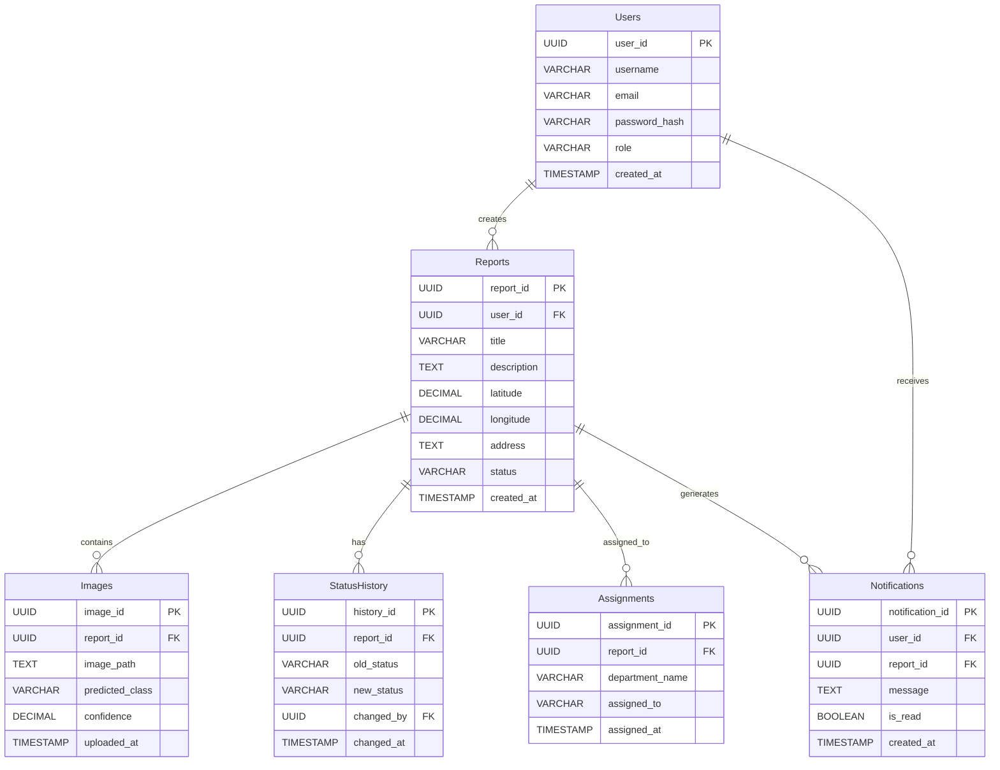

# NagarConnect Database Design

## Overview

NagarConnect is an AI-powered civic issue reporting platform where citizens can report infrastructure issues such as potholes, road cracks, garbage, open manholes, and waterlogging.

The application uses:

- Frontend: React
- Backend: Node.js + Express
- AI Service: FastAPI + YOLOv8
- Database: PostgreSQL

The database is designed to support:

- User Authentication
- Complaint Reporting
- Image Uploads
- AI Detection Results
- Complaint Tracking
- Status History
- Department Assignments
- Notifications

---

# Database Tables

## 1. Users

### Purpose

Stores registered user information.

### Columns

| Column | Data Type | Constraints |
|---------|-----------|------------|
| user_id | UUID | Primary Key |
| username | VARCHAR(50) | Unique, Not Null |
| email | VARCHAR(100) | Unique, Not Null |
| password_hash | VARCHAR(255) | Not Null |
| role | VARCHAR(20) | Default 'citizen' |
| created_at | TIMESTAMP | Default CURRENT_TIMESTAMP |

### Primary Key

- user_id

### Foreign Keys

None

### Example Record

```json
{
  "user_id": "550e8400-e29b-41d4-a716-446655440000",
  "username": "john_doe",
  "email": "john@example.com",
  "role": "citizen"
}
```

---

# 2. Reports

### Purpose

Stores every civic complaint submitted by users.

### Columns

| Column | Data Type | Constraints |
|---------|-----------|------------|
| report_id | UUID | Primary Key |
| user_id | UUID | Foreign Key |
| title | VARCHAR(150) | Not Null |
| description | TEXT | Not Null |
| latitude | DECIMAL(10,8) | Not Null |
| longitude | DECIMAL(11,8) | Not Null |
| address | TEXT | Nullable |
| status | VARCHAR(30) | Default 'Pending' |
| created_at | TIMESTAMP | Default CURRENT_TIMESTAMP |

### Primary Key

- report_id

### Foreign Keys

- user_id → Users.user_id

### Example Record

```json
{
  "title":"Large pothole",
  "status":"Pending"
}
```

---

# 3. Images

### Purpose

Stores uploaded images and AI prediction results.

### Columns

| Column | Data Type | Constraints |
|---------|-----------|------------|
| image_id | UUID | Primary Key |
| report_id | UUID | Foreign Key |
| image_path | TEXT | Not Null |
| predicted_class | VARCHAR(50) | Nullable |
| confidence | DECIMAL(5,2) | Nullable |
| uploaded_at | TIMESTAMP | Default CURRENT_TIMESTAMP |

### Primary Key

- image_id

### Foreign Keys

- report_id → Reports.report_id

### Example Record

```json
{
  "predicted_class":"Pothole",
  "confidence":96.42
}
```

---

# 4. StatusHistory

### Purpose

Maintains every status update of a complaint.

### Columns

| Column | Data Type | Constraints |
|---------|-----------|------------|
| history_id | UUID | Primary Key |
| report_id | UUID | Foreign Key |
| old_status | VARCHAR(30) | Not Null |
| new_status | VARCHAR(30) | Not Null |
| changed_by | UUID | Foreign Key |
| changed_at | TIMESTAMP | Default CURRENT_TIMESTAMP |

### Primary Key

- history_id

### Foreign Keys

- report_id → Reports.report_id
- changed_by → Users.user_id

---

# 5. Assignments

### Purpose

Stores which municipal department is responsible for a complaint.

### Columns

| Column | Data Type | Constraints |
|---------|-----------|------------|
| assignment_id | UUID | Primary Key |
| report_id | UUID | Foreign Key |
| department_name | VARCHAR(100) | Not Null |
| assigned_to | VARCHAR(100) | Nullable |
| assigned_at | TIMESTAMP | Default CURRENT_TIMESTAMP |

### Primary Key

- assignment_id

### Foreign Keys

- report_id → Reports.report_id

---

# 6. Notifications

### Purpose

Stores notifications sent to users.

### Columns

| Column | Data Type | Constraints |
|---------|-----------|------------|
| notification_id | UUID | Primary Key |
| user_id | UUID | Foreign Key |
| report_id | UUID | Foreign Key |
| message | TEXT | Not Null |
| is_read | BOOLEAN | Default FALSE |
| created_at | TIMESTAMP | Default CURRENT_TIMESTAMP |

### Primary Key

- notification_id

### Foreign Keys

- user_id → Users.user_id
- report_id → Reports.report_id

---

# Entity Relationship Diagram



---

# Relationship Summary

- One User can create many Reports.
- One Report can contain multiple Images.
- One Report can have multiple Status History entries.
- One Report can have one or more Assignments.
- One User can receive multiple Notifications.
- Notifications are linked to specific Reports.

---

# Suggested Indexes

Create indexes on:

- Users.email
- Reports.user_id
- Reports.status
- Reports.created_at
- Images.report_id
- StatusHistory.report_id
- Notifications.user_id

These indexes improve lookup performance for authentication, report history, and dashboards.

---

# Database Normalization

The schema follows Third Normal Form (3NF):

- Every table has a single responsibility.
- No duplicate information is stored.
- Relationships are maintained using foreign keys.
- Data redundancy is minimized.

---

# Naming Conventions

- Table names use PascalCase.
- Primary keys use the format `<table>_id`.
- Foreign keys reference the primary key of the related table.
- Timestamps use `_at` suffixes.
- Boolean fields begin with `is_`.

---

# Future Scalability

Possible future improvements include:

- Department table instead of department_name
- Multiple image uploads per complaint
- AI model version tracking
- Complaint priority levels
- Soft deletes
- Audit logs
- GIS support using PostGIS
- Database replication and backups
- Redis caching
- Search optimization

---

# Conclusion

The NagarConnect database is designed to be modular, scalable, and easy to maintain. The schema supports AI-powered civic issue detection while allowing future enhancements without major structural changes.