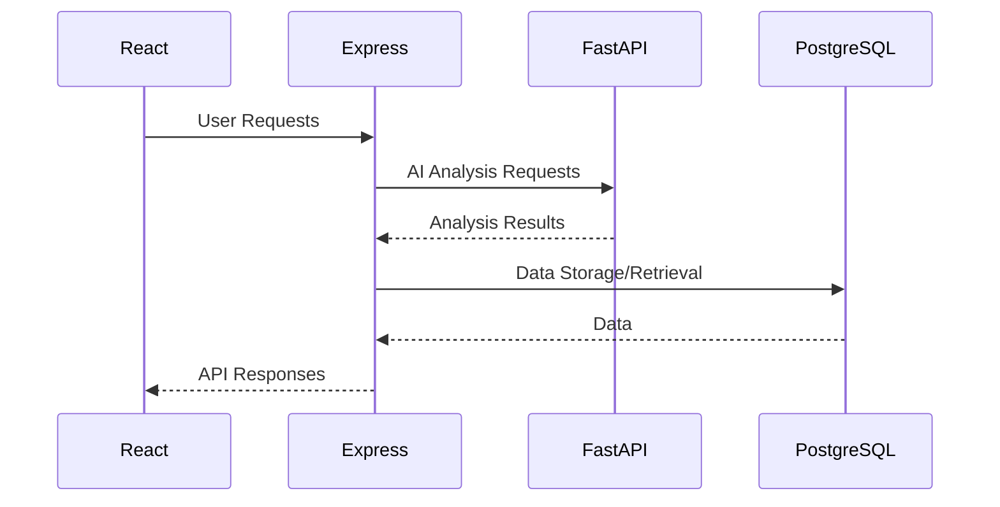
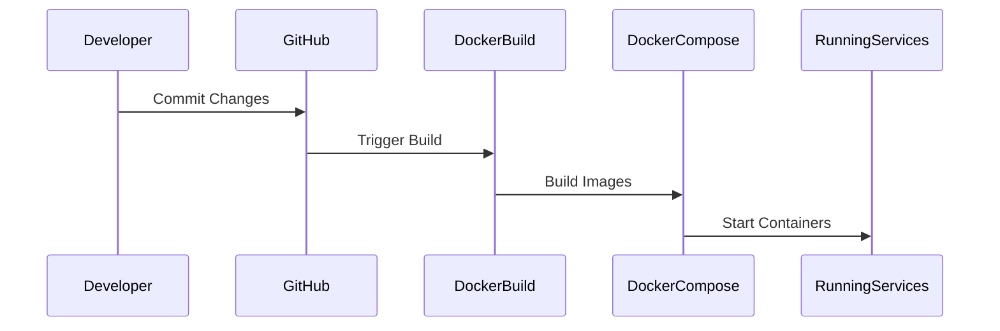

# Deployment Documentation for NagarConnect

## 1. Overview

The deployment architecture of NagarConnect is designed to ensure scalability, security, and ease of maintenance. The platform consists of a React frontend, an Express.js backend, a FastAPI AI service, and a PostgreSQL database, all containerized using Docker with Docker Compose.

## 2. Services

### React Frontend
- **Purpose**: Provides the user interface for interacting with NagarConnect, allowing citizens to report civic issues and view reports.
  
### Express Backend
- **Purpose**: Manages API endpoints, interacts with the database, processes user requests, and communicates with the AI service.

### FastAPI AI Service
- **Purpose**: Utilizes YOLOv8 for analyzing images related to reported civic issues, providing insights or classifications necessary for issue resolution.

### PostgreSQL Database
- **Purpose**: Stores all application data including user information, issue reports, and AI analysis results.

## 3. Docker Architecture

## 4. Docker Compose

### Why Docker Compose is used
- **Simplicity**: Easily define and run multi-container Docker applications.
- **Isolation**: Each service runs in its own isolated container, ensuring clean separation of concerns.
- **Networking**: Provides a simple way to manage inter-service communication.

### How containers communicate
- **Internal Networking**: Containers are connected through an internal network created by Docker Compose, allowing them to communicate using service names as hostnames.

### Internal networking
- Services can reach each other via service names defined in the `docker-compose.yml`.

### Environment variables
- Environment variables are managed within the `docker-compose.yml` file and are used for configuring services like database connection strings and API keys.

## 5. Ports

| Service      | Port   |
|--------------|--------|
| React        | 3000   |
| Express      | 4000   |
| FastAPI      | 8000   |
| PostgreSQL   | 5432   |

## 6. Environment Variables

### Frontend
- `REACT_APP_API_URL`: URL of the Express backend.

### Backend
- `PORT`: Port number for the Express server.
- `DATABASE_URL`: Connection string for PostgreSQL.
- `FASTAPI_URL`: URL of the FastAPI service.

### AI Service
- `PORT`: Port number for the FastAPI server.
- `MODEL_PATH`: Path to the YOLOv8 model file.

### Database
- `POSTGRES_USER`: Username for PostgreSQL.
- `POSTGRES_PASSWORD`: Password for PostgreSQL.
- `POSTGRES_DB`: Database name.

## 7. Deployment Workflow

1. Developer makes changes and commits them to GitHub.
2. GitHub triggers a Docker build process.
3. Docker builds the images for each service.
4. Docker Compose starts the containers, linking them as defined in the configuration.
5. Services are now running and ready to handle requests.

#### Sequence Diagram

## 8. Production Deployment

### Reverse Proxy (Nginx)
- **Purpose**: Manages incoming HTTP requests, serves static files from React, and forwards requests to the appropriate backend service.

### HTTPS
- **Implementation**: Use Nginx to redirect all HTTP traffic to HTTPS.

### SSL Certificates
- **Management**: Obtain certificates via Let's Encrypt or another certificate authority and configure them in Nginx.

### Backups
- **Frequency**: Regularly back up the PostgreSQL database using `pg_dump` and store backups in a secure location.
- **Automation**: Use tools like cron jobs or cloud-based backup solutions.

### Logging
- **Configuration**: Implement centralized logging using ELK stack (Elasticsearch, Logstash, Kibana) or similar tools to monitor application logs.

### Monitoring
- **Tools**: Use Prometheus and Grafana for monitoring service health and performance metrics.

## 9. Scalability

### Frontend
- **Scaling Method**: Deploy multiple instances behind a load balancer like NGINX to handle increased user requests.
  
### Backend
- **Scaling Method**: Scale Express.js instances horizontally using Docker Swarm or Kubernetes, ensuring they can handle more concurrent connections.

### AI Service
- **Scaling Method**: Depending on resource requirements, scale FastAPI instances either vertically (more powerful machine) or horizontally (more machines).

### Database
- **Scaling Method**: Use PostgreSQL replication and clustering techniques to manage higher load and ensure data redundancy.

## 10. Security

### Secrets Management
- **Tools**: Use tools like AWS Secrets Manager, Azure Key Vault, or HashiCorp Vault to securely manage sensitive information such as API keys and database credentials.

### Environment Variables
- **Best Practices**: Avoid hardcoding secrets in environment variables; instead, reference them from secure management solutions.

### Docker Networks
- **Configuration**: Define appropriate network policies and use overlay networks for service communication.

### Firewall
- **Rules**: Implement firewall rules to restrict access to only necessary ports and services.

### Database Security
- **Access Control**: Use strong authentication methods (e.g., PostgreSQL roles) and limit database connections to trusted IP addresses or through VPNs.

## 11. Future Improvements

- **Kubernetes**: Migrate the deployment infrastructure to Kubernetes for more robust orchestration and scaling capabilities.
  
- **CI/CD**: Set up a continuous integration and delivery pipeline using tools like Jenkins, GitLab CI/CD, or GitHub Actions to automate testing and deployment.

- **GitHub Actions**: Utilize GitHub Actions for automating various tasks including building images, running tests, and deploying the application.

- **Cloud Deployment (AWS/Azure/GCP)**: Deploy NagarConnect on cloud platforms for additional scalability and reliability.

- **Load Balancing**: Implement load balancing to distribute traffic across multiple instances of each service.

- **Redis**: Integrate Redis as an in-memory data store for caching and improving performance.

- **Object Storage**: Use cloud-based object storage solutions like Amazon S3 or Google Cloud Storage for storing large files or images related to issue reports.

---
This document provides a comprehensive overview of the deployment architecture, services, Docker configuration, and best practices used in NagarConnect. It covers everything from development workflow to production deployment and future enhancements.